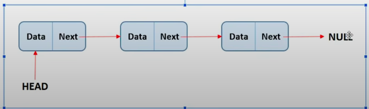
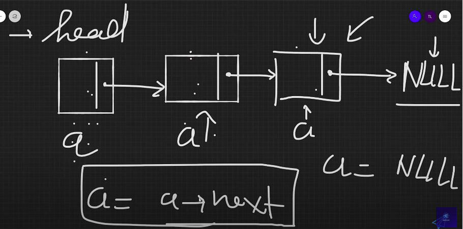

1. Danh sách liên kết đơn(Linked List):
- Mảng: Yêu cầu tất cả các ô nhớ trong mảng phải liên tiếp nhau 
- Linked-List: Các phần tử trong linked list thì được gọi là một node. Nó có thể nằm rải rác khắp nơi, không nhất thiết là phải liền kề nhau như mảng. Mỗi phần tử của linked list được cấp phát động(được cấp phát khi chạy chương trình => tối ưu bộ nhớ hơn array, nhưng cũng sẽ khó lập trình hơn).

2. Cấu tạo từng phần tử Node
- 1 Node gồm 2 phần chính:
    + Data: 1 vùng lưu trữ 1 số hoặc thông tin của 1 đối tượng nào đó
    + Next: 1 tham chiếu tới node kế tiếp (lưu địa chỉ của node đứng sau node hiện tại)

3. Làm sao để quản lý Danh sách liên kết của mình?
- Chỉ cần biết node đầu tiên là có thể quản lý được toàn bộ node khác

4. Nhược điểm của linked-list so với Array:
- Không thể truy cập thông qua chỉ số index như mảng (do linked list không yêu cầu tất cả các ô nhớ phải liền kề nhau), mà phải duyệt từng node một
=> muốn tìm 1 node nào đó là sẽ phải tìm từ node đầu tiên trước rồi lần lượt tới điểm cần duyệt => Lâu

5. Ưu điểm so với Array:
- Có thể mở rộng hoặc thu nhỏ tùy ý (do mỗi node được cấp phát động) => có thể khai báo tới khi hết RAM thì thôi

6. Cách khai báo 1 node:
struct Node{
    int data; //Dữ liệu của node
    Node *next; //Địa chỉ node tiếp theo (lưu địa chỉ => dùng pointer)
}

Chú ý: Do mỗi node được cấp phát động nên coi như 1 node = 1 pointer có kiểu là node
typedef struct Node* listNode; //Định nghĩa 1 kdl mới tên là listNode, đại diện cho 1 con trỏ tới struct Node
=> mỗi lần khai báo thêm 1 node ở linked-list, ta chỉ cần dùng listNode là được

7. Đếm xem trong linked list có bao nhiêu phần tử
Ta chỉ cần duyệt từ đầu (di chuyển node head di chuyển qua từng phần tử trong list, đến khi node head chạy đến NULL tức là node head chạy qua tất cả các phần tử có trong linked list rồi, mỗi lần duyệt qua là tăng biến đếm lên 1 lần là được)

